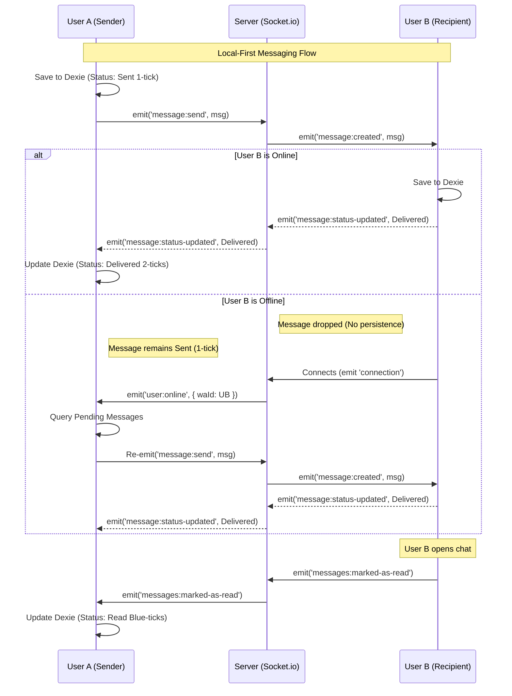

# Quick Chat - Analysis & Documentation

**Quick Chat** is a modern, full-stack WhatsApp Clone designed for learning production-grade architecture. It features real-time messaging, secure authentication, and a scalable codebase.

## 📚 Documentation

- **[Frontend Documentation](./client/README.md)**: Next.js Client, UI components, and State Management.
- **[Backend Documentation](./server/README.md)**: Node.js Server, API Endpoints, and Docker Deployment.

---

## 📁 Project Structure

The project is organized as a monorepo with distinct Client and Server applications.

### 🖥️ Client (`/client`)
Built with **Next.js 15**, **Tailwind**, and **Zustand**.
- `app/`: App Router pages.
- `components/`: UI and Chat components.
- `services/`: API integration.

### ⚙️ Server (`/server`)
Built with **Node.js**, **Express**, **Prisma**, and **Socket.io**.
- `src/modules/`: Feature-based modules (Auth, User, Message).
- `src/lib/`: Core infrastructure (Socket, Logger, Prisma).
- `prisma/`: Database schema.
- `Dockerfile`: Production deployment configuration.

---

## 🚀 Quick Start

1. **Clone the Repo**
   ```bash
   git clone <repo-url>
   cd quick-chat
   ```

2. **Start Backend**
   ```bash
   cd server
   pnpm install
   pnpm run dev
   ```

3. **Start Frontend** (in a new terminal)
   ```bash
   cd client
   pnpm install
   pnpm run dev
   ```

4. **Visit App**
   Open `http://localhost:3000`.

---

## 🐳 Docker Support

To run the backend in a container:

```bash
cd server
docker build -t quick-chat-server .
docker run -p 8000:8000 quick-chat-server
```

See [Server README](./server/README.md) for full deployment instructions (Render, etc).

---

## 📡 Message System Architecture

Quick Chat uses a **Local-First** architecture with **Socket.io Relay** for real-time messaging. This ensures messages are instantly available to the sender and delivered in real-time to recipients without relying on server-side database persistence for the message content itself.

### Key Concepts

1.  **Local Storage (Dexie.js)**: All messages (sent and received) are stored locally in the user's browser using IndexedDB. This allows for offline access and instant UI updates (Optimistic UI).
2.  **Socket.io Relay**: The server acts as a relay. It accepts a message from the sender and immediately broadcasts it to the recipient(s). It does *not* save the message content to MongoDB.
3.  **Delivery Status**:
    *   **Single Tick**: Message saved locally and sent to server.
    *   **Double Tick (Delivered)**: Recipient received the message and acknowledged it via a socket event.
    *   **Blue Tick (Read)**: Recipient opened the chat and the app emitted a read receipt.
4.  **Offline Capability**: If a recipient is offline, the sender's client listens for the `user:online` event. When the recipient comes online, the sender's client automatically resends any pending messages.

### Message Flow Diagram


